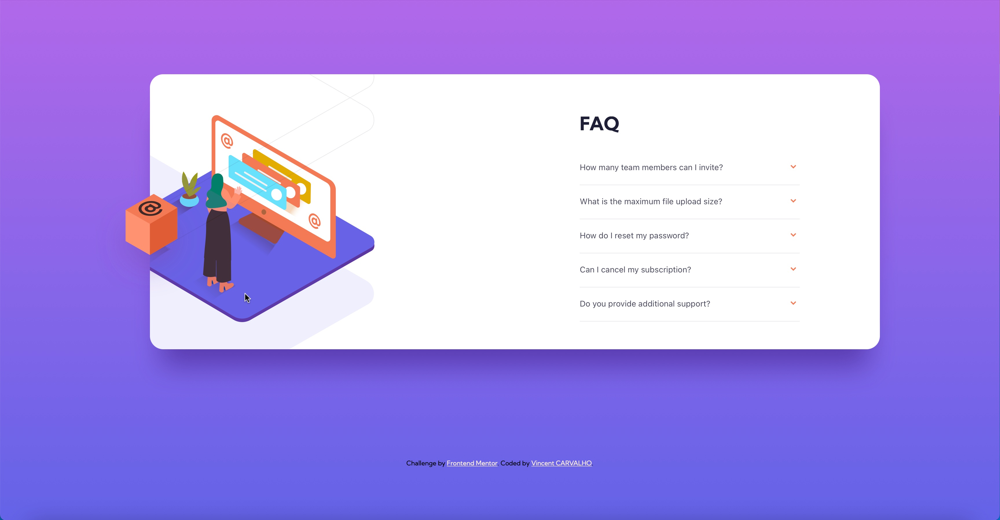

# Frontend Mentor - FAQ accordion card solution

This is a solution to the [FAQ accordion card challenge on Frontend Mentor](https://www.frontendmentor.io/challenges/faq-accordion-card-XlyjD0Oam). Frontend Mentor challenges help you improve your coding skills by building realistic projects. 

## Table of contents

- [Overview](#overview)
  - [The challenge](#the-challenge)
  - [Screenshot](#screenshot)
  - [Links](#links)
- [My process](#my-process)
  - [Built with](#built-with)
  - [What I learned](#what-i-learned)
  - [Continued development](#continued-development)
  - [Useful resources](#useful-resources)
- [Author](#author)

## Overview

### The challenge

Users should be able to:

- View the optimal layout for the component depending on their device's screen size
- See hover states for all interactive elements on the page
- Hide/Show the answer to a question when the question is clicked

### Screenshot

### Links

- Solution URL: [https://github.com/CarvalhoVincent/FAQ-accordion-card]
- Live Site URL: [https://carvalhovincent.github.io/FAQ-accordion-card/]

## My process

### Built with

- Semantic HTML5 markup
- CSS custom properties
- Flexbox
- JavaScript
- Mobile-first workflow

### What I learned

I learned how to make an accordion with JavaScript, how to use overflow: hidden on images except one, how to place elements more accurate with position relative and absolute, how to use more accurately margins, paddings etc... Since my first project, I think my responsive skills improved too. Even if there is still lot of work to do !

### Continued development

I want to continue my progression in every aspect of building webpages, and be more efficient.

### Useful resources

- [https://www.w3schools.com] - Use it for some searches and reminders, and for the accordion method.
- [https://stackoverflow.com/ ] - Use for some information about the font-weight in my buttons, and to overflow hidden some images except one.

## Author

- Frontend Mentor - [@CarvalhoVincent](https://www.frontendmentor.io/profile/CarvalhoVincent)

# FAQ-accordion-card
